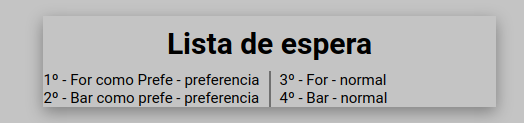

# Consutorio
Exemplo de atendimento de um consutório, com dois prefies de atendimento: Normal ou Preferêncial.

A ordem de prioridade são os **Preferenciais**, dentre os **Preferencias** quem chegar primeiro tem prioridade sobre os demais preferenciais, e todo prefencial tem predominância sobre os **Normais**.

Chamar o proximo é sempre o primeiro da lista e **Limpar lista** zera a lista totalmente.

# Page Demo
[Page demo aqui](https://leltonborges.github.io/lista-de-espera/)
